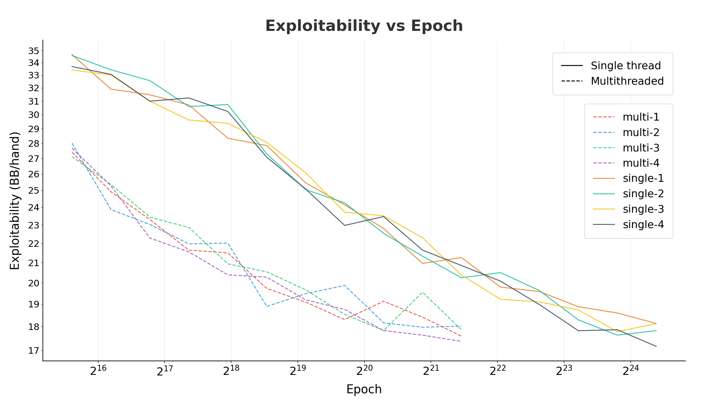

# Poker Bot
By: Jonathan Lin

Accompanying writing for this repo: [jonathanlin.net/thoughts/poker-bot](https://jonathanlin.net/thoughts/poker-bot)

I highly recommend reading it if you plan to use any part of this repository.

## Requirements

Install cmake
```
sudo apt install -y cmake build-essential --no-update
```

## Precompute Equity
This step isn't necessary, but it's highly recommended. The precomputed equity speeds up convergence in early epochs. Running the program for a few hours should be enough.
```
# configure and build
cmake -B build && cmake --build build

# run
./build/precompute_equity
```

## Train
This process takes a few days on a 12 core (24 thread) CPU, where each core had a max boost clock of to 5.6 GHz. This may take more or less time depending on the specifications of your hardware.
```
# configure and build
# highest level of compiler optimization. recommended for training
cmake -B build -DCMAKE_BUILD_TYPE=Release -DCMAKE_CXX_FLAGS_RELEASE="-O3 -march=native" && cmake --build build

# run
./build/poker_train -n "default-name" --num-threads 1
```

## Run Tests
```
# configure, build, and run
cmake -B build && cmake --build build && ./build/poker_tests

# sometimes there's WSL race conditions. So, you can build single threaded with the following
cmake -B build && cmake --build build -j1 && ./build/poker_tests
```

## Project Structure

- `include/config.hpp` - Config constants
- `include/` - Header files
- `src/` - Source files
- `data/` - Generated precomputed equity and training output
- `build/` - Cmake build output and compiled binaries

## Visualizations

### Exploitability
Plots each experiment's exploitability per hand. Exploitability is the maximum expected profit an opponent can make against the bot if the exploiter always chooses the best response in each situation. The best response is the action that maximizes their EV. Exploitability will always be positive, but it should asymptotically approach 0 as the bot gets better.
```
python scripts/graph_exploitability.py
```

Example:
